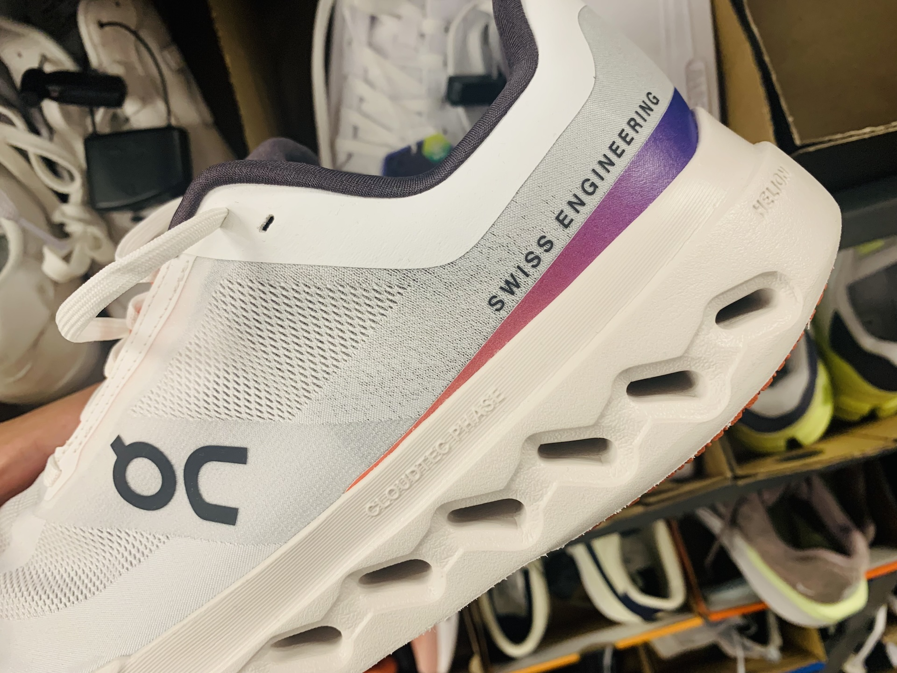
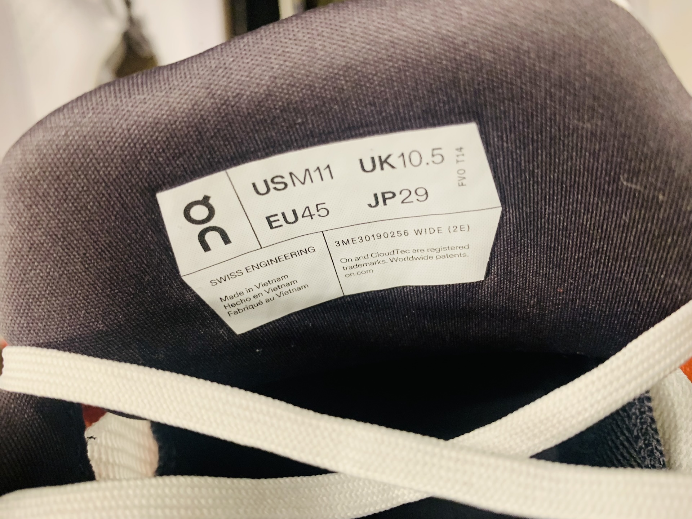

import Quote from "../../../components/Quote.astro";

ขณะที่ผมเดินเลือกซื้อสินค้าในร้านแห่งหนึ่งในสหรัฐอเมริกา ผมเดินมาถึงโซนรองเท้า ที่เต็มไปด้วยแบรนด์มากมาย
มีรองเท้าคู่หนึ่งที่สะดุดตาเป็นพิเศษ

มันคือรองเท้าแบรนด์ ON แบรนด์สายสปอร์ตจากสวิตเซอร์แลนด์ที่มาแรงในช่วงไม่กี่ปีที่ผ่านมา ด้วยดีไซน์ที่เรียบแต่เฉียบ มินิมอลแต่มีเอกลักษณ์ มันชั่งเย้ายวนเงินในกระเป๋าผมเป็นอย่างมาก แต่สิ่งที่ทำให้ผมหยุดจ้อง...ไม่ใช่ป้ายราคา

หากแต่เป็นข้อความที่อยู่ข้างรองเท้าที่เขียนไว้ว่า **"Swiss Engineering"** และเมื่อผมพลิกดูข้อมูลที่ลิ้นรองเท้า
ก็พบข้อความเล็ก ๆ **"Made in Vietnam"** — ความย้อนแย้งเล็ก ๆ ที่สะท้อนโครงสร้างเศรษฐกิจโลกในปัจจุบัน

ผมหยิบรองเท้าขึ้นมาพลิกดูอีกครั้ง ไม่ใช่เพราะลังเลจะซื้อ แต่เพราะความรู้สึกบางอย่างมันตีขึ้นมาในใจโดยอัตโนมัติ

ในขณะนี้ ประเทศไทยกำลังเผชิญประเด็นสำคัญเกี่ยวกับภาษีนำเข้าสินค้าบางประเภทจากสหรัฐอเมริกา (Reciprocal Tariff) ที่มีอัตราสูงถึง 36% — แม้ว่ายังอยู่ในระหว่างการเจรจา แต่ก็สร้างแรงกดดันต่อผู้ผลิตและผู้ส่งออกไทยอย่างหลีกเลี่ยงไม่ได้

ยิ่งไปกว่านั้น ประเทศเวียดนาม ซึ่งเป็นคู่แข่งสำคัญของไทยในหลายด้าน โดยเฉพาะในภาคเศรษฐกิจและการลงทุน กลับสามารถเจรจาจนลดอัตราภาษีนำเข้าเหลือเพียง 20%

ความแตกต่างนี้ไม่เพียงส่งผลต่อราคาสินค้าในตลาดโลกเท่านั้น
แต่มันยังสะท้อนถึงความได้เปรียบเชิงโครงสร้างที่ **ยิ่งกดทับศักยภาพในการแข่งขันของไทยอย่างรุนแรง**

## ทำไมสวิตเซอร์แลนด์เป็นเจ้าของไอเดีย และเวียดนามเป็นผู้ผลิต?

### นวัตกรรมจากสวิตเซอร์แลนด์

แม้จะเป็นประเทศเล็ก ไม่มีทางออกสู่ทะเล และไม่มีทรัพยากรธรรมชาติมากมาย สวิตเซอร์แลนด์กลับกลายเป็นผู้นำด้านนวัตกรรมของโลกอย่างต่อเนื่อง โดยครองอันดับ 1 ในดัชนีนวัตกรรมโลก (Global Innovation Index) มานานกว่า 12 ปีติดต่อกัน จุดแข็งสำคัญคือการลงทุนด้านการวิจัยและพัฒนา (R&D) ที่มากกว่า 3% ของ GDP โดยสองในสามเป็นการลงทุนจากภาคเอกชน ทำให้สวิตเซอร์แลนด์มีจำนวนสิทธิบัตรต่อประชากรสูงที่สุดในโลก

ระบบนิเวศนวัตกรรมของสวิตเซอร์แลนด์เชื่อมโยงกันอย่างแน่นแฟ้นระหว่างภาครัฐ มหาวิทยาลัย และภาคธุรกิจ เช่น ETH Zurich และ EPFL Lausanne ไม่เพียงเป็นมหาวิทยาลัยระดับโลก แต่ยังเชื่อมต่อกับวิสาหกิจขนาดกลางและเล็กผ่านศูนย์วิจัยประยุกต์ รวมถึงระบบการศึกษาคู่ขนานแบบ “Dual Education” ที่ผสมผสานทั้งการเรียนรู้เชิงทฤษฎีและการฝึกปฏิบัติจริง

ด้วยโครงสร้างแบบนี้ สวิตเซอร์แลนด์จึงสามารถสร้าง “หุบเขาแห่งนวัตกรรม” ในหลายเมือง ไม่ว่าจะเป็น Crypto Valley ที่เมือง Zug หรือ Drone Valley ที่ลอซานน์ และผลักดันแนวคิด **"Swiss Engineering"** ให้กลายเป็นสัญลักษณ์ของคุณภาพ ความน่าเชื่อถือ และการออกแบบที่มีคุณค่าในระดับโลก

### เวียดนาม: ศูนย์กลางการผลิตระดับโลก

เวียดนามได้พัฒนาตนเองเป็น **ศูนย์กลางการผลิตระดับโลก** โดยอาศัยปัจจัยเชิงกลยุทธ์หลายประการ เช่น ต้นทุนแรงงานที่ยังแข่งขันได้มากที่สุดในภูมิภาค; โครงสร้างพื้นฐานที่แข็งแรง ทั้งสนามบิน ท่าเรือ และทางรถไฟที่เชื่อมโยงภายในประเทศและกับตลาดโลก; การลงทุนในเขตอุตสาหกรรมและเขตเศรษฐกิจพิเศษกว่า 400 แห่ง; รวมถึงสิทธิประโยชน์ทางภาษีและกฎหมายที่เอื้อต่อ FDI และการค้าโลกผ่านข้อตกลงการค้าเสรี (FTAs) หลัก ๆ ที่เวียดนามเข้าร่วมทำให้ประเทศมีความได้เปรียบเหนือคู่แข่งหลายราย

ไม่เพียงแต่ต้นทุนต่ำเท่านั้น เวียดนามยังมุ่งขยับตัวไปสู่ การผลิตที่มีผลิตภาพสูงขึ้น (high‑productivity manufacturing) ด้วยการสนับสนุน Industry 4.0, การปรับปรุงกฎหมายเพื่อสนับสนุนอุตสาหกรรมเทคโนโลยีสูง และเพิ่มทักษะแรงงานในภาคอิเล็กทรอนิกส์และเซมิคอนดักเตอร์ ส่งผลให้บริษัทระดับโลกอย่าง Samsung, Foxconn, Intel, Nike ลงทุนในประเทศอย่างต่อเนื่อง

เมื่อพิจารณากลยุทธ์ทั้งหมดนี้ เวียดนามใช้ FDI เป็นเครื่องมือสำคัญในการสร้าง ระบบนิเวศอุตสาหกรรมที่ครบวงจร — ไม่ใช่แค่ฐานผลิตราคาถูก แต่เป็นฐานผลิตที่ตอบโจทย์ด้านคุณภาพ ประสิทธิภาพ และความยั่งยืน รองรับเป้าหมายการเติบโตของประเทศสู่ประเทศอุตสาหกรรมสมัยใหม่ที่มีรายได้ปานกลางระดับสูง (upper‑middle income) ภายในปี 2573 (2030) และเป็นประเทศพัฒนาแล้วที่มีรายได้สูง (high‑income developed) ภายในปี 2593 (2050)

## ประเทศไทยอยู่ตรงไหนในโลก?

ในอดีต ประเทศไทยถูกขนานนามว่า 'เสือตัวที่ห้าแห่งเอเชีย' จากการเติบโตอย่างรวดเร็ว หลังมี**นโยบายเปลี่ยนสนามรบเป็นสนามการค้า**และดึงดูด FDI ในยุค 2530s แต่หลังวิกฤตต้มยำกุ้ง ไทยไม่ได้ยกระดับไปสู่เศรษฐกิจฐานความรู้เหมือนที่เกาหลีใต้หรือไต้หวันทำได้ทันเวลา

วันนี้ เรายังผลิตอยู่ — แต่ก็เริ่มถูกเบียดจากเวียดนาม อินโดนีเซีย และบังกลาเทศ
เราพยายามพัฒนาไปสู่เศรษฐกิจที่ขับเคลื่อนด้วยนวัตกรรม แต่กลับติดกับดักหลายประการ

- การศึกษาที่ยังไม่พร้อมสู่ศตวรรษหน้า
- ระบบราชการล่าช้า ไม่เข้าใจเทคโนโลยีใหม่
- การทุจริตในหน่วยงานภาครัฐ
- การสนับสนุน Startup และ Deep Tech ที่ยังไม่จริงจัง
- โครงสร้างประชากรที่เข้าสู่สังคมผู้สูงอายุ
- จำนวนประชากรที่ลดต่ำลง ขาดแคลนแรงงาน
- หนี้ครัวเรือนที่สูงกดดันการบริโภค
- ขาดเสถียรภาพทางการเมือง
- ฯลฯ
  
ผลลัพธ์ก็คือ **ไทยกลายเป็นประเทศที่ “ยังไม่หลุดจากกับดักการผลิต” แต่ก็ยัง “ไม่สามารถสร้างคุณค่าใหม่”** ได้เช่นกัน

## คำถามชวนคิด: เราจะไปทางไหน?

เราจะเอาอย่างเวียดนามแล้วเน้นผลิตในราคาถูกให้กับแบรนด์ต่างชาติ?

หรือเราจะตั้งเป้าเป็นอย่างสวิตเซอร์แลนด์ — ประเทศที่สร้างความโดดเด่นด้วย “Engineering”, “Design”, และ “Innovation”?

ทางเลือกที่สามก็มี คือการ สร้างเอกลักษณ์ของตัวเอง ผ่านการผสมผสานความคิดสร้างสรรค์ วัฒนธรรม ความรู้ ทักษะ และเทคโนโลยี และมาประยุกต์ใช้ในการสร้างมูลค่าเพิ่มให้กับสินค้าและบริการ รวมถึงการพัฒนาธุรกิจและอุตสาหกรรมใหม่ ๆ โดยอาศัยนวัตกรรมและเทคโนโลยี

แต่ไม่ว่าทางไหน เราต้องเลือก ก่อนที่โลกจะเลือกให้เรา

<Quote>
ถ้าเราไม่เร่งสร้างคุณค่าของตัวเองในวันนี้ วันหนึ่งเราอาจกลายเป็นเพียงผู้ผลิตที่ถูกแทนที่ได้ง่ายที่สุด
</Quote>